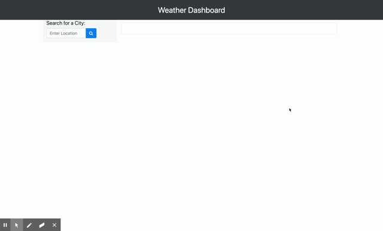

# weather-dashboard

## Table of contents

- [General info](#general-info)
- [Technologies](#technologies)
- [Authors](#authors)

## General info

A weather application to search for the weather in the location entered that shows the local "entered" weather, humidity, wind speed, UV index and a 5 day forecast. The application also saves entered locations into local storage, so when the page is updated the locations entered don't get removed.

## Technologies

This app runs in the browser and features dynamically updated with:

- HTML
- CSS
- JavaScript
- jQuery
- JSON
- Ajax
- OpenWeather API

## Authors

- **Karla McLeod** - _Initial work_ - [Kmcleod81](https://github.com/Kmcleod81)

## Link to Page

- https://kmcleod81.github.io/weather-dashboard/
